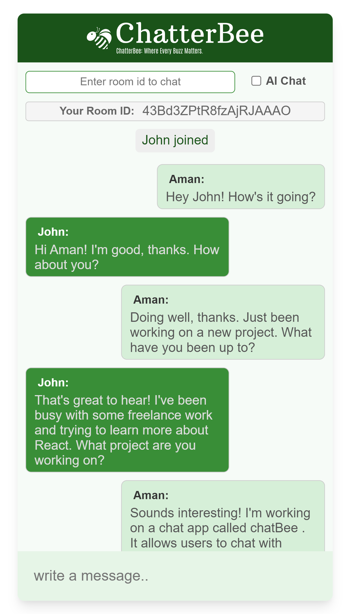
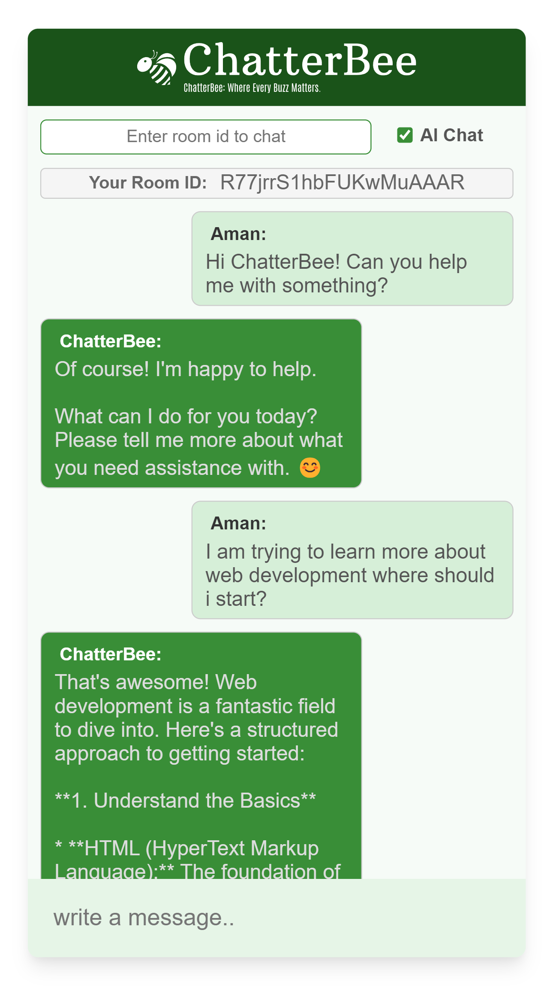

<div align='center'>
<h1>ChatterBee</h1>
<p>ChatterBee is an interactive web application that facilitates real-time communication among users. Leveraging Node.js, Express, Socket.io, and the Google Gemini, it allows users to chat publicly with everyone or privately with specific individuals using unique room IDs. Additionally, users can interact with an AI to get solutions or answers to their queries.</p>

**<a href= "https://chatterbee.up.railway.app/">View Demo</a>**

</div>

## Table of contents

- About this Project
- Features
- Run Locally
- Contact

## About this project
### 📸 Screenshots

<div align='center'>

<h3>Chat with friends</h3>



<h3>Chat with AI</h3>



</div>

---
### 🎯 Features
- **Real-Time Group Chat**:🗣️ Communicate with all users in real-time in a public chat room.
- **Private Chats**:🔒 Have personal conversations by entering your friend's room ID in the room ID input field.
- **AI Interaction**:🤖 Talk to ChatterBee AI for assistance, information, or just for fun!
---

### ❓ How to Use

1. **Group Chat**: 🗣️  Simply join the main chat room to start chatting with everyone.
2. **Private Chat**: 🔒 Enter your friend's room ID in the room ID input field to join their private room.
3. **AI Chat**: 🤖 Select the AI chat option to start a conversation with ChatterBee AI.
---


## Getting Started

### 🏃 Run Locally
clone the project
```bash
https://github.com/amanprasad2707/ChatterBee
```
Install dependencies
```bash
npm install
```
start the server
```bash
npm run dev
```
or
```bash
npm start
```
---

## Contact
<div style="width: 30px;">
  
</div>


Aman Prasad - [LinkedIn](https://www.linkedin.com/in/amanprasad2707/)

Email - aprasad2707@gmail.com

Project Link - [GitHub](https://github.com/amanprasad2707/ChatterBee)

#### Enjoy your conversations with ChatterBee!